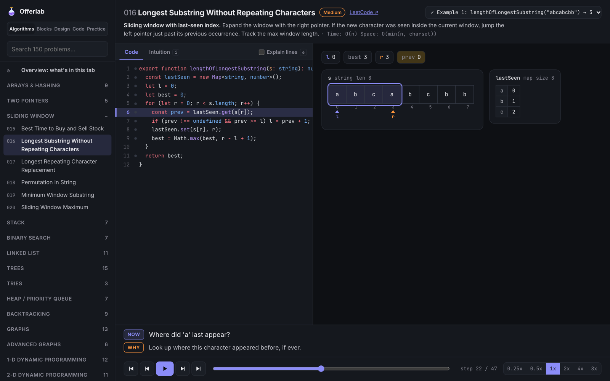
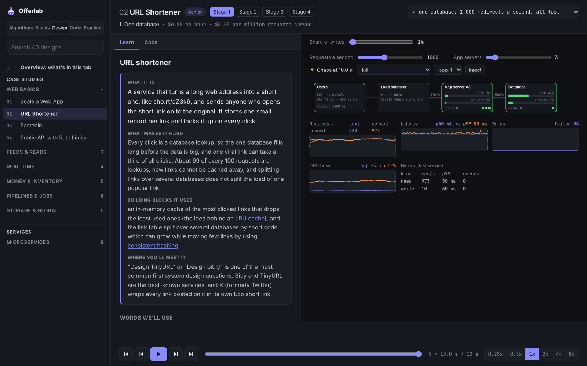
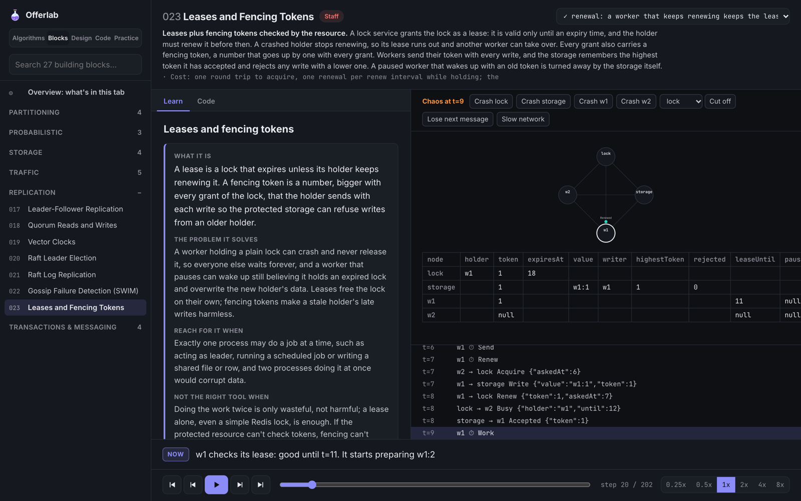

<p align="center">
  <picture>
    <source media="(prefers-color-scheme: dark)" srcset=".github/assets/offerlab-lockup-dark.svg">
    
  </picture>
</p>

<p align="center">
  <strong>Interview prep you can watch run.</strong><br>
  The NeetCode 150 and system design from first principles, step by step, in your browser.
</p>

<p align="center">
  <a href="https://shivarajbakale.github.io/offerlab/"><strong>Live demo</strong></a> ·
  <a href="#whats-inside">What's inside</a> ·
  <a href="#run-it-locally">Run it locally</a> ·
  <a href="CONTRIBUTING.md">Contributing</a>
</p>

<p align="center">
  <a href="https://github.com/shivarajbakale/offerlab/actions/workflows/ci.yml"></a>
  <a href="LICENSE"></a>
  
  
</p>

<p align="center">
  
</p>

## Why Offerlab

Reading a solution tells you *what* the code does. Watching it run shows you *why* it works. Offerlab runs each
solution and simulation for real, one step at a time. Pointers slide, windows grow, trees re-link, queues back
up and servers fall over, right next to the line of code that caused it.

Each lesson starts from first principles: what the idea is, the problem it solves, and the naive approach that
fails first.

## What's inside

| Track | What you get |
| --- | --- |
| **Algorithms** | All **150 NeetCode problems** in TypeScript, each with the approach, complexity, tests and a step-by-step trace |
| **Building blocks** | **27 primitives** (consistent hashing, Bloom filters, Raft, leases and fencing tokens, two-phase commit…) as runnable simulations |
| **System design** | **31 case studies** (URL shortener, news feed, chat, payments…) plus **9 microservice patterns**, with live traffic, latency charts and chaos injection |
| **Code design** | **9 low-level design** and **9 API design** lessons |
| **Practice** | **35 drills**: back-of-the-envelope estimation, failure scenarios and flashcards |

<table>
  <tr>
    <td></td>
    <td></td>
  </tr>
  <tr>
    <td align="center"><sub>Case studies: tune the load, add servers, inject failures</sub></td>
    <td align="center"><sub>Building blocks: every message between nodes, step by step</sub></td>
  </tr>
</table>

## Run it locally

You need Node.js 26 or newer, which runs TypeScript directly with no build step.

```bash
git clone https://github.com/shivarajbakale/offerlab.git
cd offerlab
npm install
npm --prefix viz install
npm run viz          # opens the visualizer at http://localhost:5173
```

Run the solutions and their tests without the visualizer:

```bash
npm test                                                        # every problem and simulation
node --test neetcode-150/07-trees/*.ts                          # one category
node neetcode-150/01-arrays-hashing/001-contains-duplicate.ts   # one problem
npm run typecheck                                               # strict tsc
```

Keyboard: `space` play/pause · `←` `→` step · `[` `]` speed · `i` intuition · `e` explain lines.

## Project layout

```
neetcode-150/     one self-contained file per problem, in NeetCode roadmap order
system-design/    building blocks, case studies, microservices, LLD, API design, drills
viz/              the React visualizer that traces and animates everything above
```

More detail: [`neetcode-150/README.md`](neetcode-150/README.md) · [`viz/README.md`](viz/README.md)

## Self-hosting

The visualizer is a static site. Build it with `npm --prefix viz run build` and serve `viz/dist` from anywhere, or
use the included `Dockerfile`, which serves it with nginx on port 8080.

## Contributing

Fixes, new problems, new simulations and better explanations are all welcome. Read [CONTRIBUTING.md](CONTRIBUTING.md)
to get started.

## License

[MIT](LICENSE). Problem names link to LeetCode; LeetCode and NeetCode are trademarks of their owners, and this project
is not affiliated with either.
